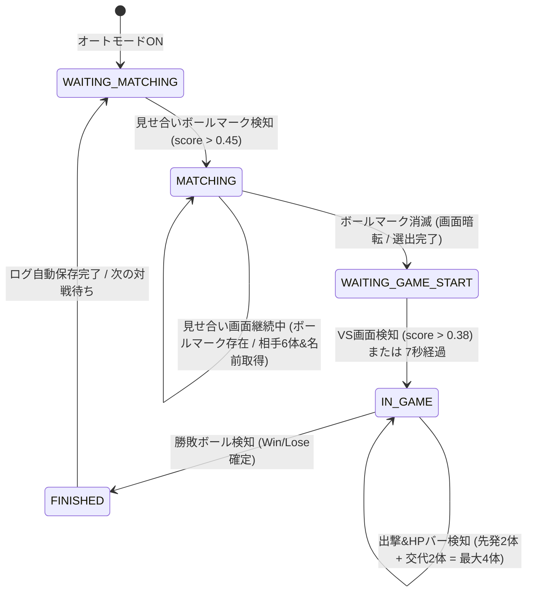

# オートモード詳細仕様定義書 (Auto Mode Specification)

本書は、ポケモン対戦ログ（Pokemon Battle Log）における「オートモード（全自動対戦検知・記録システム）」の完全なアーキテクチャ、状態遷移、認識座標パラメータ、およびアルゴリズムを定義する公式仕様書です。

> **運用ルール (重要)**
> 今後オートモードのコード（`scripts/auto_mode_controller.js`, `scripts/recognition_engine.js` 等）を修正・改修する場合は、**必ず本仕様書を同時に修正・更新**してください。仕様書とコードの乖離は一切認められません。

---

## 1. 全体アーキテクチャと処理フロー

オートモードは、Switch実機映像（1920×1080、16:9）を毎秒約2〜3回（350ms間隔）キャプチャし、ステートマシンによって現在のゲーム画面のフェーズを判定しながら、相手パーティ、相手トレーナー名、自分・相手の選出（4体）、勝敗を自動取得して記録フォームに入力します。

---

## 2. 状態遷移 (ステートマシン) 詳細定義

| フェーズ名 (`this.phase`) | 画面の状態 | 監視対象・トリガー | UI画面遷移・データ入力動作 | 遷移先フェーズ | pamo3 内部対応 |
| :--- | :--- | :--- | :--- | :--- | :--- |
| **`WAITING_MATCHING`** | 対戦マッチング待機中 | 画面左下の選出ボタンボールマーク (`COORDS.MATCHING_BALL`) の一致度 > 0.45 | オートモード開始時に「記録する」タブへ自動切替。 フォームを初期化（ルール=ダブル、手持ち読込） | `MATCHING` | `waitingMatching` (`B.xO`) |
| **`MATCHING`** | 見せ合い画面（手持ち6体と選出選択） | 初回フレームで相手6体・トレーナー名を自動取得。 その後ボールマークの一致度 < 0.35 になるまで本フェーズを維持 | ① 画面を「記録する」画面へ確実に維持。 ② 相手パーティ6体を `#opp-party-slots` へ自動入力しアイコン更新。 ③ 相手トレーナー名を `#rec-opp-trainer` へ自動入力。 ④ 相手選出ドロップダウンを再構築。 | `WAITING_GAME_START` | `matching` (`B.ms`) |
| **`WAITING_GAME_START`** | 見せ合い終了〜対戦開始演出 | 中央VSロゴ (`COORDS.VS_SCREEN`) 一致度 > 0.38、または見せ合い終了から 7000ms 経過 | ユーザーの手動修正があればリアルタイム同期。 出撃演出の監視準備 | `IN_GAME` | `waitingGameStart` (`B.i3`) |
| **`IN_GAME`** | 対戦中（出撃演出、コマンド画面、交代） | 出撃ネームプレート、常時表示HPバー、様子を見るパネルを監視して自分・相手の選出（最大4体）を取得。 勝敗ボール検知で試合終了判定 | ① 検知された自分選出（最大4体）をバッジ・ボールへ反映。 ② 検知された相手選出（最大4体）をドロップダウン・ボールへ反映。 ③ 勝敗ボール検知で勝敗（勝ち/負け）ボタンを自動セット。 | `FINISHED` | `inGame` (`B.i2`) |
| **`FINISHED`** | 勝敗確定画面 | 勝敗確定後、ログ保存処理を実行 | ① `saveRecord()` を実行して対戦ログを自動保存。 ② **保存完了後、自動的に「履歴 (`history`)」タブへ画面遷移**。 ③ 次の対戦へ向けて待機状態へリセット。 | `WAITING_MATCHING` | `endGame` (`B.FZ`) |

---

## 3. 認識座標パラメータ一覧 (1920 × 1080 基準)

### 3.1 フェーズ検知用座標

| 項目名 | X | Y | Width | Height | 使用テンプレート画像 | 判定しきい値 |
| :--- | :--- | :--- | :--- | :--- | :--- | :--- |
| `MATCHING_BALL` (見せ合いボールマーク) | 139.0 | 923.0 | 46.0 | 46.0 | `assets/images/opencv/champions/template_ui/matching_phase_ball.png` | `> 0.45` で見せ合い開始 `< 0.35` で見せ合い終了 |
| `VS_SCREEN` (VS画面中央ロゴ) | 860.0 | 565.0 | 200.0 | 80.0 | `assets/images/opencv/champions/template_ui/vs_v.png` | `> 0.38` で対戦開始 |
| `WIN_BALL_ME` (自分側勝利ボール) | 445.3 | 771.0 | 72.0 | 72.0 | `assets/images/opencv/champions/template_ui/win_ball.png` | `> 0.50` で勝ち判定 |
| `WIN_BALL_RIVAL` (相手側勝利ボール) | 1405.0 | 771.0 | 72.0 | 72.0 | `assets/images/opencv/champions/template_ui/win_ball.png` | `> 0.50` で負け判定 |

### 3.2 見せ合い画面認識用座標 (`MATCHING`)

| 項目名 | X | Y | Width | Height | 照合アルゴリズム | 備考 |
| :--- | :--- | :--- | :--- | :--- | :--- | :--- |
| **相手アイコン (スロット $i=0..5$)** | 1620.8 | $159.5 + 125.9 \times i$ | 104.6 | 104.6 | `assets/pokemon_icons/*.png` の実画像透過マスクMSE照合 | タイプ絞り込み後の候補から最小差分を特定 |
| **属性アイコン1 (タイプ1)** | 1750.2 | $172.0 + 126.0 \times i$ | 40.0 | 40.0 | `assets/type_icons/template_*.png` (40×40) 実画像MSE照合 | 18属性から最小差分タイプを特定 |
| **属性アイコン2 (タイプ2)** | 1801.0 | $172.0 + 126.0 \times i$ | 40.0 | 40.0 | `assets/type_icons/template_*.png` (40×40) 実画像MSE照合 | MSE > 5500 または暗背景なら `none` |
| **相手トレーナー名** | 1562.0 | 95.4 | 280.0 | 47.6 | Tesseract OCR (白文字二値化 + 2x拡大) | 多言語対応 (`jpn+eng+...`) |

### 3.3 選出・出撃・交代検知用座標 (`IN_GAME`)

すべての座標は水平テキスト領域として定義され、Tesseract OCR（カタカナ・ひらがな・英数字対応）で読み取られます。

#### ① 出撃演出時ネームプレート (`COORDS.DISPATCH_DOUBLE`)
* **相手先発1**: `X: 1196.7, Y: 50.0, W: 220.0, H: 46.0`
* **相手先発2**: `X: 1599.8, Y: 50.0, W: 220.0, H: 46.0`
* **自分先発1**: `X: 154.9,  Y: 933.0, W: 220.0, H: 46.0`
* **自分先発2**: `X: 554.6,  Y: 933.0, W: 220.0, H: 46.0`

#### ② 対戦中常時表示HPバー上のネームプレート (`COORDS.BATTLE_HP_DOUBLE`)
通常コマンド画面（「たたかう」「ポケモン」等が出ている画面）で常時表示されるHPバーのネームプレートです。
* **相手スロット1 (上段左)**: `X: 1140.0, Y: 35.0,  W: 240.0, H: 55.0`
* **相手スロット2 (上段右)**: `X: 1510.0, Y: 35.0,  W: 240.0, H: 55.0`
* **自分スロット1 (下段左)**: `X: 180.0,  Y: 860.0, W: 240.0, H: 55.0`
* **自分スロット2 (下段右)**: `X: 530.0,  Y: 860.0, W: 240.0, H: 55.0`

#### ③ 様子を見る（ターゲット選択）画面ネームプレート (`COORDS.TARGET_SELECT_DOUBLE`)
技選択後に対象を選ぶ際、中央に特大表示されるネームプレート領域です。
* **相手ターゲット1 (左上)**: `X: 960.0,  Y: 225.0, W: 190.0, H: 50.0`
* **相手ターゲット2 (右上)**: `X: 1330.0, Y: 225.0, W: 190.0, H: 50.0`
* **自分ターゲット1 (左下)**: `X: 960.0,  Y: 532.0, W: 190.0, H: 50.0`
* **自分ターゲット2 (右下)**: `X: 1330.0, Y: 532.0, W: 190.0, H: 50.0`

---

## 4. 前処理とOCR・照合アルゴリズム

### 4.1 ネームプレートOCR前処理 (`cropForDispatchOcr`)
1. **原寸切り出し**: 指定座標 `(x, y, w, h)` を Canvas に切り出し。
2. **2倍拡大描画**: Tesseract の認識精度を最大化するため 2x に拡大。
3. **高コントラスト白文字二値化**:
   - 輝度 $Y = 0.299R + 0.587G + 0.114B$
   - $Y \ge 170$ または $(R > 165 \land G > 165 \land B > 165)$ のピクセルを「黒（文字 0）」、それ以外を「白（背景 255）」に変換。
4. **Tesseract.js OCR**: カタカナ・ひらがな辞書を用いて文字認識を実行。

### 4.2 ポケモン名ファジーマッチング
1. OCR結果テキストから空白・改行を除去。
2. 照合プール（相手なら `rivalPartyNames`、自分なら `myPartyNames`）：
   - レーベンシュタイン編集距離を計算。
   - フォルム名（メガ、原種等）の正規化ベース名とも比較。
3. **編集距離 $\le 2$** の場合、一致として採用。
4. 相手側で手持ちと一致しなかった場合、全体マスタ（`POKEMON_LIST`）からフォールバック検索（手入力ミスや認識漏れの自動救済）。

### 4.3 交代・繰り出し追跡ロジック (ダブルバトル4枠)
* 各陣営（自分・相手）の選出リスト（`detectedDispatchedMe`, `detectedDispatchedRival`）は配列として管理。
* 出撃・HPバー検知で新しいポケモン名が認識された場合：
  - まだリストに含まれていなければ、次のスロット（3体目、4体目）として自動追加。
  - 下部のモンスターボールUIおよび選出スロットに即時反映。
* 上限（4体）に達した陣営はOCR監視を自動停止し、CPU負荷を最小化。

---

## 5. 見せ合い画面の「ボールマーク」詳細

### 5.1 画面上の位置
Switch 1920×1080 画面において、**左下の選出完了ボタン（「[ > ◓ 4/4 選出完了 ]」）の緑色フレームの左端にある、モンスターボールの丸いアイコン**です。
* 座標: `X: 139.0, Y: 923.0, W: 46.0, H: 46.0`
* このマークは、見せ合い画面（選出を考えている時間、カウントダウン中）の間、常時表示されています。
* プレイヤーが選出を完了するか時間切れになると、ボタン全体が画面からフェードアウト（消滅）して暗転します。

### 5.2 フェーズ判定の役割
* `score > 0.45`: 見せ合い画面が出現したと判定し、相手6体とトレーナー名を取得。
* `score >= 0.35`: 見せ合い画面が継続中であると判定し、**絶対に試合中へ移行しない**。
* `score < 0.35`: 見せ合いが終了した（暗転した）と判定し、対戦開始待機（`WAITING_GAME_START`）へ移行。

---

## 6. UI画面遷移および入力フォーム連携仕様

### 6.1 オートモード開始時
* `window.showPage('record')` を呼び出し、アプリの画面を「記録する」タブへ自動で切り替えます。
* 対戦ルールを「ダブルバトル（選出4体）」に固定し、最新の登録手持ちパーティをロードして初期化します。

### 6.2 見せ合い画面検知時 (`MATCHING`)
* 相手パーティ6体の認識結果を、相手パーティスロット `#opp-party-slots input[type=text]` へ順番に入力し、スロットアイコン（`updateSlotIcon`）を更新します。
* 相手トレーナー名の認識結果を、`#rec-opp-trainer` へ自動入力します。
* `rebuildOppSelectionDropdowns()` を呼び出し、相手選出の選択肢ドロップダウンを認識した6体で再構築します。
* ユーザーが見せ合い中に手動修正を行った場合は、リアルタイムに入力イベントを検知して出撃照合候補（`rivalPartyNames`）に同期します。

### 6.3 対戦中 (`IN_GAME`)
* 出撃演出および対戦中HPバーから自分・相手のポケモンが検知されるたびに：
  - 自分の選出（最大4体）: 画面上の自分選出バッジ（1〜4）および下部モンスターボールUIを自動更新。
  - 相手の選出（最大4体）: 相手選出ドロップダウンを自動選択し、下部モンスターボールUIを自動更新。

### 6.4 試合終了時 (`FINISHED`)
* 勝敗ボール検知結果に基づき、フォームの「勝ち（#btn-win）」または「負け（#btn-lose）」ボタンを自動選択。
* 万一見せ合い取得漏れがあった場合でも、検知された出撃ポケモンで相手パーティを自動補完。
* `window.saveRecord()` を実行して対戦ログをローカル/クラウドへ自動保存。
* **保存完了の約1.2秒後、`window.showPage('history')` を呼び出して自動的に「履歴」タブへ画面遷移**します。
* 画面遷移後、ステートマシンは自動的に `WAITING_MATCHING`（次の対戦待機）へリセットされ、次回マッチングに備えます。

---

## 7. 改修・保守ルール

1. **引数ルールの遵守**:
   `recognitionEngine.recognize` をオートモードから呼び出す際は、必ず **第4引数に `true` (`isSwitch1080p`)** を渡すこと。渡さないと iPhone 用座標系（X=1955等）が使用され認識が全滅します。
2. **ステートマシンのフライング防止**:
   画面認識結果以外の「安易な短い固定タイマー」だけでフェーズを強制遷移させてはならない。必ずゲーム画面のUIマーク（ボールマーク、VSロゴ、HPバー等）の有無を基準にすること。
3. **本仕様書の更新**:
   座標値の調整、しきい値の変更、新機能追加を行ったエンジニアは、コードのコミットと同時に本ドキュメントを更新すること。
