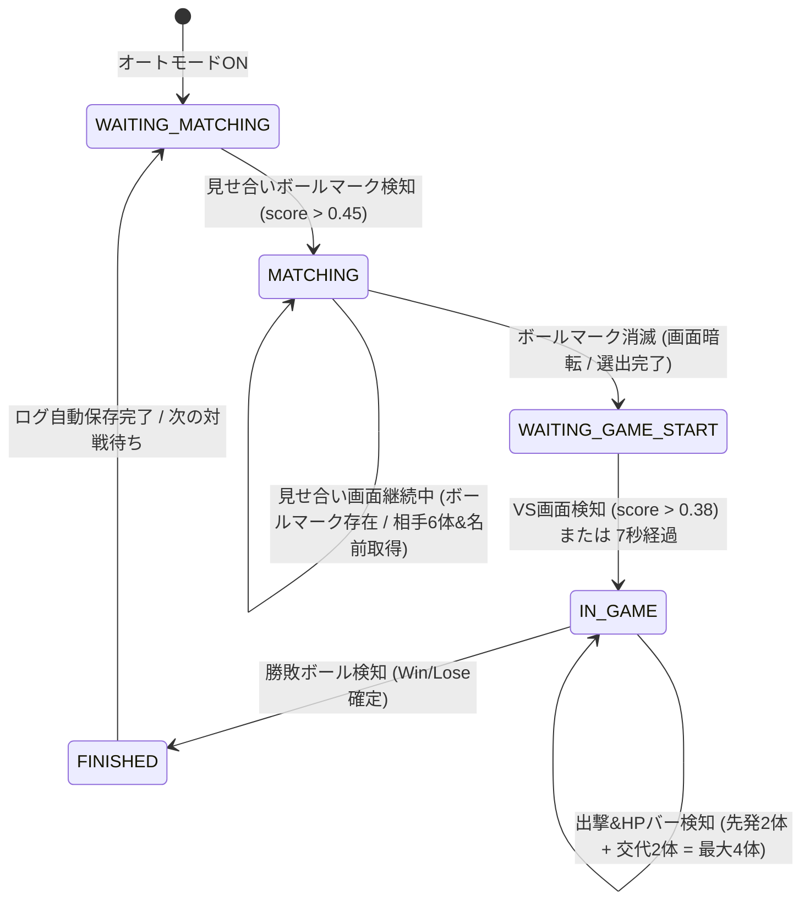
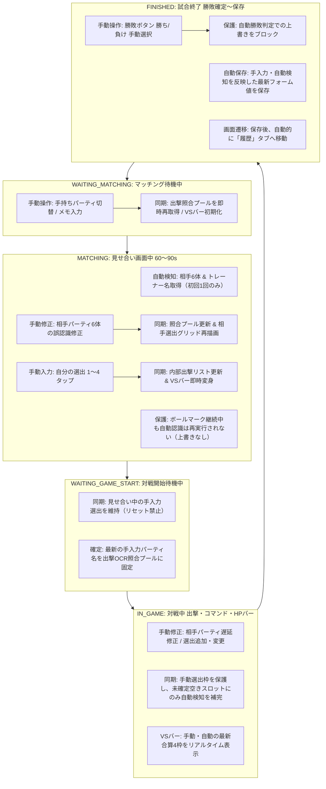

# オートモード詳細仕様定義書 (Auto Mode Specification)

本書は、ポケモン対戦ログ（Pokemon Battle Log）における「オートモード（全自動対戦検知・記録システム）」の完全なアーキテクチャ、状態遷移、認識座標パラメータ、およびアルゴリズムを定義する公式仕様書です。

> **運用ルール (重要)**
> 今後オートモードの仕様・コード（`scripts/auto_mode_controller.js`, `scripts/recognition_engine.js` 等）を修正・改修する場合は、**必ず本仕様書（Markdown版 `AUTO_MODE_SPECIFICATION.md` および HTML版 `AUTO_MODE_SPECIFICATION.html` の両方）を同時に修正・更新**してください。仕様書とコードの乖離は一切認められません。

---

## 1. 全体アーキテクチャと処理フロー

オートモードは、Switch実機映像（1920×1080、16:9）を毎秒約2〜3回（350ms間隔）キャプチャし、ステートマシンによって現在のゲーム画面のフェーズを判定しながら、相手パーティ、相手トレーナー名、自分・相手の選出（4体）、勝敗を自動取得して記録フォームに入力します。

---

## 2. 状態遷移 (ステートマシン) 詳細定義 (1:1:1 対応仕様)

各フェーズにおいて、システムが**「何を監視し (監視対象)」「どういう条件で発火し (トリガー条件)」「発火時に何を実行してどこへ遷移するか (動作と遷移)」**を 1:1:1 で厳密に対応づけて定義します。

| フェーズ名 (`this.phase`) | 画面の状態 | ① 監視対象 (What) | ② トリガー条件 (Condition) | ③ 発火時に起こる動作 (Action & Behavior) | 遷移先 | pamo3 内部対応 |
| :--- | :--- | :--- | :--- | :--- | :--- | :--- |
| **`WAITING_MATCHING`** (マッチング待機中) | 対戦相手の検索中 / ロビー画面 | 画面左下の選出完了ボタンボールマーク (`COORDS.MATCHING_BALL`) | `matching_phase_ball.png` との一致度 `score > 0.45` | ① バッジを「見せ合い画面検知: 相手情報取得中...」に更新。 ② 前回の選出リストとVSバーを初期化 (`resetVsBar`)。 ③ 画面を「記録する」タブへ切替 (`showPage('record')`)。 ④ ルールをダブルバトルに固定し、手持ちパーティを選択・展開。 ⑤ 画面全体キャプチャを認識エンジンへ渡し、相手6体とトレーナー名を自動取得してフォームへ入力。 | `MATCHING` | `waitingMatching` (`B.xO`) |
| **`MATCHING`** (見せ合い画面中) | 手持ち6体と選出選択画面 (カウントダウン中) | **[A]** 画面左下の選出完了ボタンボールマーク (`COORDS.MATCHING_BALL`) | 一致度 `score >= 0.35` (マークが継続表示中) | 本フェーズ（`MATCHING`）を維持。 ※相手認識は突入時の初回1回のみ実行し、ループ再実行による手入力上書きは行わない。 | (維持) | `matching` (`B.ms`) |
| ^ | ^ | **[B]** 画面左下の選出完了ボタンボールマーク (`COORDS.MATCHING_BALL`) | 一致度 `score < 0.35` (選出完了/時間切れでマーク消滅・暗転) | ① 見せ合い終了タイムスタンプを記録 (`waitingStartTimestamp = Date.now()`)。 ② バッジを「対戦開始待ち (VS画面待機中...)」に更新。 ③ 次の対戦開始待ちへフェーズを切り替える。 | `WAITING_GAME_START` | ^ |
| ^ | ^ | **[C]** ユーザーによる相手パーティ修正 / 手動選出タップ | フォームへの `input`/`change` イベント、または選出カードのクリック | ① 相手パーティ入力時: 照合候補リスト（`rivalPartyNames`）を即時更新し、相手選出グリッドを再描画。 ② 手動選出時: `mySelectionOrder` からポケモン名を取り込み、右下VSバーのモンスターボールを該当ポケモンアイコンに変身させる。 | (維持) | - |
| **`WAITING_GAME_START`** (対戦開始待機中) | 見せ合い終了後の画面暗転〜VS画面演出中 | **[A]** 画面中央VSロゴ領域 (`COORDS.VS_SCREEN`) | `vs_v.png` との一致度 `vsScore > 0.38` | ① バッジを「試合中: 出撃ポケモン検知中...」に更新。 ② 見せ合い中に入力された手動選出を保持したまま内部リスト・VSバーを同期。 ③ 出撃ネームプレート検知を開始。 | `IN_GAME` | `waitingGameStart` (`B.i3`) |
| ^ | ^ | **[B]** 暗転からの経過時間タイマー (`Date.now() - waitingStartTimestamp`) | 暗転後 `elapsed > 7000ms` (VSアニメーション演出等の認識漏れフォールバック) | ① バッジを「試合中: 出撃ポケモン検知中...」に更新。 ② 手動選出を保持したまま内部リスト・VSバーを同期。 ③ 先発ポケモンの出撃演出を見逃さないよう直ちに出撃検知を開始。 | `IN_GAME` | ^ |
| **`IN_GAME`** (試合中) | 出撃演出、コマンド画面、技アニメーション、交代 | **[A]** 出撃ネームプレート、対戦中HPバー、様子を見るパネル (`COORDS.DISPATCH_DOUBLE` 等) | 白文字OCR結果とパーティ候補（`rivalPartyNames` / `myPartyNames`）との編集距離 `dist <= 2` | ① まだ選出リストに含まれていない場合、空き枠（最大4枠）にそのポケモン名を追加（手動確定枠は保護）。 ② 右下VSバーのモンスターボールを検知されたポケモンアイコン・名前に変身させる。 ③ フォームの選出スロット（`setSelectionFromNames`）に自動反映。 ④ 4枠確定した陣営はOCRを自動停止。 | (維持) | `inGame` (`B.i2`) |
| ^ | ^ | **[B]** 画面右上の勝利ボール領域 (`COORDS.WIN_BALL_ME`, `WIN_BALL_RIVAL`) | `win_ball.png` との一致度 `myScore > 0.45` または `rivalScore > 0.45` | ① 勝者を判定 (`isWin = myScore > rivalScore`)。 ② バッジを「試合終了: 🎉 勝利」または「試合終了: 破れたり...」に更新。 ③ `_handleGameFinished(isWin)` を呼び出して終了処理を開始。 | `FINISHED` | ^ |
| **`FINISHED`** (試合終了〜保存) | 試合終了演出〜勝敗確定画面 | 勝敗確定後の自動保存・遷移シーケンスキュー | `FINISHED` フェーズへの突入 | ① **T+0ms**: 相手パーティに空欄があれば出撃検知ポケモンで自動補完。ユーザーの手動選択がなければ判定結果（勝ち/負け）ボタンを自動セット。 ② **T+800ms**: `saveRecord()` を実行して対戦ログを自動保存。 ③ **T+2000ms**: 保存完了後、`showPage('history')` を呼び出して**自動的に「履歴」タブへ画面遷移**。 ④ **T+2000ms**: 状態を初期化し、次回マッチング待ちへ移行。 | `WAITING_MATCHING` | `endGame` (`B.FZ`) |

---

## 3. 認識座標パラメータ一覧 (1920 × 1080 基準)

### 3.1 フェーズ検知用座標

| 項目名 | X | Y | Width | Height | 使用テンプレート画像 | 判定しきい値 |
| :--- | :--- | :--- | :--- | :--- | :--- | :--- |
| `MATCHING_BALL` (見せ合いボールマーク) | 139.0 | 923.0 | 46.0 | 46.0 | `assets/images/opencv/champions/template_ui/matching_phase_ball.png` | `> 0.45` で見せ合い開始 `< 0.35` で見せ合い終了 |
| `VS_SCREEN` (VS画面中央ロゴ) | 860.0 | 565.0 | 200.0 | 80.0 | `assets/images/opencv/champions/template_ui/vs_v.png` | `> 0.38` で対戦開始 |
| `WIN_BALL_ME` (自分側勝利ボール) | 445.3 | 771.0 | 72.0 | 72.0 | `assets/images/opencv/champions/template_ui/win_ball.png` | `> 0.50` で勝ち判定 |
| `WIN_BALL_RIVAL` (相手側勝利ボール) | 1405.0 | 771.0 | 72.0 | 72.0 | `assets/images/opencv/champions/template_ui/win_ball.png` | `> 0.50` で負け判定 |

### 3.2 見せ合い画面認識用座標 (`MATCHING`)

| 項目名 | X | Y | Width | Height | 照合アルゴリズム | 備考 |
| :--- | :--- | :--- | :--- | :--- | :--- | :--- |
| **相手アイコン (スロット $i=0..5$)** | 1620.8 | $159.5 + 125.9 \times i$ | 104.6 | 104.6 | `assets/pokemon_icons/*.png` の実画像透過マスクMSE照合 | pamo3 `aBO.cKJ` 完全準拠 (間隔125.9) |
| **属性アイコン1 (タイプ1)** | 1750.2 | $172.0 + 126.0 \times i$ | 40.0 | 40.0 | `assets/type_icons/template_*.png` (40×40) 実画像MSE照合 | pamo3 `byN.aoK` 完全準拠 (間隔126.0) |
| **属性アイコン2 (タイプ2)** | 1801.0 | $172.0 + 126.0 \times i$ | 40.0 | 40.0 | `assets/type_icons/template_*.png` (40×40) 実画像MSE照合 | MSE > 5500 または暗背景なら `none` |
| **相手トレーナー名** | 1562.0 | 95.4 | 280.0 | 47.6 | Tesseract OCR (白文字二値化 + 2x拡大) | 多言語対応 (`jpn+eng+...`) |

> **Y座標間隔（125.9 vs 126.0）に関する補足 (pamo3 原典仕様)**:
> 相手アイコンの間隔が `125.9` に対し属性アイコンが `126.0` となっているのは、**pamo3 の原典ソースコード（`aBO.cKJ` および `byN.aoK`）と全く同一の実装仕様**です。
> pamo3 ではポケモンアイコンは実数サンプリング（`159.5 + 125.9 * a`）、属性アイコンは整数のピクセル間隔（`172 + 126 * s`）で実装されており、最下段（スロット5）でも累積差はわずか `0.1px × 5 = 0.5px`（1ピクセル未満）です。40×40の領域に対して0.5pxのズレは認識率に一切影響しないため、原典の高精度パラメータを完全再現しています。

### 3.3 選出・出撃・交代検知用座標 (`IN_GAME`)

すべての座標は水平テキスト領域として定義され、Tesseract OCR（カタカナ・ひらがな・英数字対応）で読み取られます。

#### ① 出撃演出時ネームプレート (`COORDS.DISPATCH_DOUBLE`)
* **相手先発1**: `X: 1196.7, Y: 50.0, W: 220.0, H: 46.0`
* **相手先発2**: `X: 1599.8, Y: 50.0, W: 220.0, H: 46.0`
* **自分先発1**: `X: 154.9,  Y: 933.0, W: 220.0, H: 46.0`
* **自分先発2**: `X: 554.6,  Y: 933.0, W: 220.0, H: 46.0`

#### ② 対戦中常時表示HPバー上のネームプレート (`COORDS.BATTLE_HP_DOUBLE`)
通常コマンド画面（「たたかう」「ポケモン」等が出ている画面）で常時表示されるHPバーのネームプレートです。
* **相手スロット1 (上段左)**: `X: 1140.0, Y: 35.0,  W: 240.0, H: 55.0`
* **相手スロット2 (上段右)**: `X: 1510.0, Y: 35.0,  W: 240.0, H: 55.0`
* **自分スロット1 (下段左)**: `X: 180.0,  Y: 860.0, W: 240.0, H: 55.0`
* **自分スロット2 (下段右)**: `X: 530.0,  Y: 860.0, W: 240.0, H: 55.0`

#### ③ 様子を見る（ターゲット選択）画面ネームプレート (`COORDS.TARGET_SELECT_DOUBLE`)
技選択後に対象を選ぶ際、中央に特大表示されるネームプレート領域です。
* **相手ターゲット1 (左上)**: `X: 960.0,  Y: 225.0, W: 190.0, H: 50.0`
* **相手ターゲット2 (右上)**: `X: 1330.0, Y: 225.0, W: 190.0, H: 50.0`
* **自分ターゲット1 (左下)**: `X: 960.0,  Y: 532.0, W: 190.0, H: 50.0`
* **自分ターゲット2 (右下)**: `X: 1330.0, Y: 532.0, W: 190.0, H: 50.0`

---

## 4. 前処理とOCR・照合アルゴリズム

### 4.1 ネームプレートOCR前処理 (`cropForDispatchOcr`)
1. **原寸切り出し**: 指定座標 `(x, y, w, h)` を Canvas に切り出し。
2. **2倍拡大描画**: Tesseract の認識精度を最大化するため 2x に拡大。
3. **高コントラスト白文字二値化**:
   - 輝度 $Y = 0.299R + 0.587G + 0.114B$
   - $Y \ge 170$ または $(R > 165 \land G > 165 \land B > 165)$ のピクセルを「黒（文字 0）」、それ以外を「白（背景 255）」に変換。
4. **Tesseract.js OCR**: カタカナ・ひらがな辞書を用いて文字認識を実行。

### 4.2 ポケモン名ファジーマッチング
1. OCR結果テキストから空白・改行を除去。
2. 照合プール（相手なら `rivalPartyNames`、自分なら `myPartyNames`）：
   - レーベンシュタイン編集距離を計算。
   - フォルム名（メガ、原種等）の正規化ベース名とも比較。
3. **編集距離 $\le 2$** の場合、一致として採用。
4. 相手側で手持ちと一致しなかった場合、全体マスタ（`POKEMON_LIST`）からフォールバック検索（手入力ミスや認識漏れの自動救済）。

### 4.3 交代・繰り出し追跡ロジック (ダブルバトル4枠)
* 各陣営（自分・相手）の選出リスト（`detectedDispatchedMe`, `detectedDispatchedRival`）は配列として管理。
* 出撃・HPバー検知で新しいポケモン名が認識された場合：
  - まだリストに含まれていなければ、次のスロット（3体目、4体目）として自動追加。
  - 下部のモンスターボールUIおよび選出スロットに即時反映。
* 上限（4体）に達した陣営はOCR監視を自動停止し、CPU負荷を最小化。

---

## 5. 見せ合い画面の「ボールマーク」詳細

### 5.1 画面上の位置
Switch 1920×1080 画面において、**左下の選出完了ボタン（「[ > ◓ 4/4 選出完了 ]」）の緑色フレームの左端にある、モンスターボールの丸いアイコン**です。
* 座標: `X: 139.0, Y: 923.0, W: 46.0, H: 46.0`
* このマークは、見せ合い画面（選出を考えている時間、カウントダウン中）の間、常時表示されています。
* プレイヤーが選出を完了するか時間切れになると、ボタン全体が画面からフェードアウト（消滅）して暗転します。

### 5.2 フェーズ判定の役割
* `score > 0.45`: 見せ合い画面が出現したと判定し、相手6体とトレーナー名を取得。
* `score >= 0.35`: 見せ合い画面が継続中であると判定し、**絶対に試合中へ移行しない**。
* `score < 0.35`: 見せ合いが終了した（暗転した）と判定し、対戦開始待機（`WAITING_GAME_START`）へ移行。

---

## 6. UI画面遷移および入力フォーム連携仕様

### 6.1 オートモード開始時
* `window.showPage('record')` を呼び出し、アプリの画面を「記録する」タブへ自動で切り替えます。
* 対戦ルールを「ダブルバトル（選出4体）」に固定し、最新の登録手持ちパーティをロードして初期化します。

### 6.2 見せ合い画面検知時 (`MATCHING`)
* 相手パーティ6体の認識結果を、相手パーティスロット `#opp-party-slots input[type=text]` へ順番に入力し、スロットアイコン（`updateSlotIcon`）を更新します。
* 相手トレーナー名の認識結果を、`#rec-opp-trainer` へ自動入力します。
* `rebuildOppSelectionDropdowns()` を呼び出し、相手選出の選択肢ドロップダウンを認識した6体で再構築します。
* ユーザーが見せ合い中に手動修正を行った場合は、リアルタイムに入力イベントを検知して出撃照合候補（`rivalPartyNames`）に同期します。

### 6.3 対戦中 (`IN_GAME`)
* 出撃演出および対戦中HPバーから自分・相手のポケモンが検知されるたびに：
  - 自分の選出（最大4体）: 画面上の自分選出バッジ（1〜4）および下部モンスターボールUIを自動更新。
  - 相手の選出（最大4体）: 相手選出ドロップダウンを自動選択し、下部モンスターボールUIを自動更新。

### 6.4 試合終了時 (`FINISHED`)
* 勝敗ボール検知結果に基づき、フォームの「勝ち（#btn-win）」または「負け（#btn-lose）」ボタンを自動選択。
* 万一見せ合い取得漏れがあった場合でも、検知された出撃ポケモンで相手パーティを自動補完。
* `window.saveRecord()` を実行して対戦ログをローカル/クラウドへ自動保存。
* **保存完了の約1.2秒後、`window.showPage('history')` を呼び出して自動的に「履歴」タブへ画面遷移**します。
* 画面遷移後、ステートマシンは自動的に `WAITING_MATCHING`（次の対戦待機）へリセットされ、次回マッチングに備えます。

---

## 7. 手入力修正（マニュアルオーバーライド）への対応仕様（各フェーズ別）

オートモード稼働中、ユーザーがUIフォームや選出バッジを手動で操作（修正・先行入力）した場合の、システム各フェーズでの対応および同期仕様を以下に定義します。

### 7.1 全体基本原則 (Core Principles)
1. **ユーザー操作の絶対優先**:
   自動画像検知の結果よりも、ユーザーがフォームや選出UIで直接入力・選択した内容が**常に最優先**されます。
2. **手動確定枠の保護 (Non-Destructive Overwrite)**:
   ユーザーが手動で確定させた入力値（相手ポケモン名、トレーナー名、自分・相手の選出枠、勝敗）を、その後の自動検知ループが勝手に上書き・消去することは固く禁じられます。
3. **部分的手動入力の協調補完**:
   ユーザーが一部のみ手動入力した場合（例: 先発2体のみ手動選出し、後発2体は未選択）、自動検知は「未確定の空きスロット」にのみ検知結果を補完します。

---

### 7.2 各フェーズでの詳細挙動と同期仕様

#### ① マッチング待機フェーズ (`WAITING_MATCHING`)
* **ユーザーが可能な操作**:
  - 自分の登録パーティの切り替え（ドロップダウンまたは一覧から選択）
  - 対戦形式（シングル/ダブル）やレギュレーション、対戦前メモの手動入力
* **システムの対応・同期仕様**:
  - パーティ切り替えイベントを検知し、`this.myPartyNames`（出撃照合プール）を切り替え後の手持ち6体で即座に再構築します。
  - 右下VSバーおよび内部選出リスト（`detectedDispatchedMe`, `detectedDispatchedRival`）はモンスターボール4個の初期状態を維持します。

#### ② 見せ合いフェーズ (`MATCHING`)
* **画面の状態**: 画面に相手の6体とトレーナー名が表示され、左下に「選出完了」ボールマークが存在する約60〜90秒間。
* **手入力修正への対応**:
  1. **相手パーティ6体の手入力修正**:
     - OCR誤認識で「???」になった枠や、別の似たポケモンと誤判定された枠をユーザーが手入力した場合、`#opp-party-slots` の `input` / `change` イベントをリッスンして検知。
     - 入力された最新テキストを即座に `this.rivalPartyNames`（出撃照合候補）へ反映。
     - `window.renderSelectionSlots('opp')` を呼び出し、相手選出グリッドのアイコン・名前を修正後の内容に即時再描画します。
     - **自動上書き防止**: ボールマークが存在して見せ合い画面が継続している間でも、相手パーティ・トレーナー名の自動認識は**突入時の1回のみ**実行されます。毎フレームのループで認識が再実行されてユーザーの手入力を上書きすることは一切ありません。
  2. **相手トレーナー名の手入力修正**:
     - `#rec-opp-trainer` を手入力・修正した場合、その値が完全に保持され、自動検知で再上書きされることはありません。
  3. **自分の選出の先行手動入力 (1〜4のバッジタップ)**:
     - 見せ合い中にユーザー自身が選出を決めた際、画面上の自分パーティアイコン（1〜4）をタップして先行入力可能。
     - `mySelectionOrder` から即座にポケモン名配列を取得し、オートモード内部の出撃リスト `detectedDispatchedMe` に同期。
     - 右下VSバーのモンスターボールが、タップしたポケモンのアイコンおよび名前へとリアルタイムに変身します。
  4. **相手の選出の先行手動入力**:
     - 相手選出グリッドをタップして予想選出を入力した場合も、同様に `detectedDispatchedRival` および右下VSバーへ即時同期されます。

#### ③ 対戦開始待機フェーズ (`WAITING_GAME_START`)
* **画面の状態**: ボールマークが消滅し、画面暗転〜VS画面演出中の約5〜7秒間。
* **システムの対応・同期仕様**:
  - 見せ合い中に入力・修正された相手パーティおよび選出枠を完全に固定・維持します。
  - **対戦開始時のリセット廃止**: 見せ合い中に入力された手動選出は、対戦突入時にも破棄されず、そのまま試合中の選出枠として引き継がれます。
  - 次の `IN_GAME` フェーズで動作する出撃ネームプレートOCR照合の照合辞書に、手入力修正後の最新文字列を確定セットします。

#### ④ 対戦中フェーズ (`IN_GAME`)
* **画面の状態**: ポケモンが出撃し、コマンド画面や技演出、交代が発生する対戦本番中。
* **手入力修正への対応**:
  1. **相手パーティの遅延修正**:
     - 対戦中に「相手の6体目はモロバレルではなくキノガッサだった」と気付いて手入力修正した場合、毎フレームの出撃検知ループの先頭で最新の `#opp-party-slots` を取り込んでいるため、直ちに `this.rivalPartyNames`（照合候補）へ追加・更新されます。
  2. **自分・相手の選出の手動修正・追加**:
     - 画面検知で拾われなかったポケモンを手動でタップして選出に追加、または誤認識された選出枠を手動でタップ解除して正しいポケモンを選び直す操作に対応。
     - **手動選択の最優先保護**: ユーザーが手動で選出したポケモンは確定枠として保護され、自動検知が消去したり上書きしたりすることはありません。
     - **部分的手動入力の安全補完**: 例えばユーザーが先発2体のみを手動入力し、後発2体が未入力の場合、対戦中に交代等で検知されたポケモンは「空いている後発2枠（3体目・4体目）」にのみ自動追加されます。
     - **上限（4体）到達時の停止**: 手動選出＋自動検知で合計4体に達した陣営は、それ以上の自動検知によるポケモンの追加や割り込みを停止します。

#### ⑤ 試合終了フェーズ (`FINISHED`)
* **画面の状態**: 勝敗確定演出（Win/Loseボール表示）から自動保存、履歴画面遷移までの間。
* **手入力修正への対応**:
  1. **勝敗の手動選択優先（「🏆 勝ち」「💀 負け」ボタン）**:
     - 自動検知の勝敗判定（WINボール判定）より前に、または判定直後にユーザーが勝敗ボタンを手動でクリックした場合、ユーザーのクリックした結果が最優先されます。
     - すでに手動選択済みの場合は、画像認識による自動セットをスキップし、手動結果を維持します。
  2. **選出・メモの最終修正**:
     - 自動保存（`saveRecord()`）が実行されるまでの間（約0.8秒）、選出やメモの最終手動修正が可能です。修正後のフォーム値が対戦ログとして保存されます。
  3. **自動補完の安全機構**:
     - もし見せ合い取得漏れで相手パーティに空欄スロットがあった場合のみ、出撃検知された相手ポケモンで空欄スロットを自動補完しますが、ユーザーが手入力済みのスロットは一切上書きしません。

---

## 8. 改修・保守ルール

1. **引数ルールの遵守**:
   `recognitionEngine.recognize` をオートモードから呼び出す際は、必ず **第4引数に `true` (`isSwitch1080p`)** を渡すこと。渡さないと iPhone 用座標系（X=1955等）が使用され認識が全滅します。
2. **ステートマシンのフライング防止**:
   画面認識結果以外の「安易な短い固定タイマー」だけでフェーズを強制遷移させてはならない。必ずゲーム画面のUIマーク（ボールマーク、VSロゴ、HPバー等）の有無を基準にすること。
3. **手入力値の非破壊原則**:
   いかなる自動認識・自動更新処理も、ユーザーが明示的に手入力したフォーム値や選出状態を消去・上書きしてはならない。必ず手動入力値をベースとして協調動作させること。
4. **本仕様書の両ファイル同期更新ルール (必須)**:
   座標値の調整、しきい値の変更、新機能追加、仕様改修を行ったエンジニアは、コードのコミットと同時に **`docs/AUTO_MODE_SPECIFICATION.md` と `docs/AUTO_MODE_SPECIFICATION.html` の両方を必ず同時に更新**すること。

